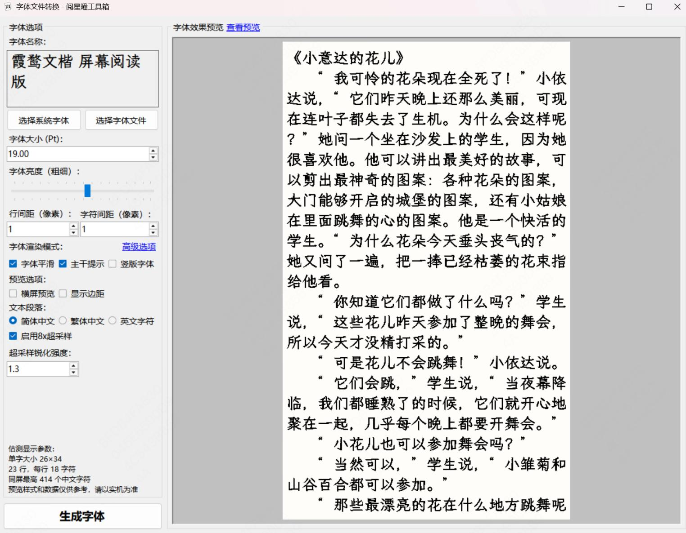

# 阅星曈电纸书相关C#代码库

> 本项目 Fork 自 [ZTYFDroid/xteink-toolkit](https://gitee.com/ZYFDroid/xteink-toolkit)  
> 原作者：ZTYFDroid
>
一些倒腾阅星曈电子书时编写的代码，目前有以下功能：

## XTEinkFontBinary.cs

读取或修改bin格式的字体文件

使用例见Playground项目

## XTEinkToolkit.csproj

字体制作工具

前往 [Release](https://github.com/KorenKrita/xteink-toolkit/releases/latest) 下载最新版本

---

### 新增功能（KorenKrita在Github更新）

#### 1. **8×超采样渲染模式**
- 新增"启用8x超采样"选项，可显著提升字体渲染质量
- 超采样模式下会以8倍分辨率渲染字体，然后通过高质量降采样算法还原到目标尺寸
- 特别适合制作高精度、抗锯齿效果更好的字体文件

#### 2. **Lanczos锐化控制**
- 新增"超采样锐化强度"调节选项（范围：0.5-2.0，推荐值：1.3）
- 基于Lanczos-2滤波器的可配置锐化算法
- 可根据字体风格调整锐化强度，获得更清晰的边缘效果
- 仅在启用超采样模式时可用

#### 3. **子像素Hinting优化**
- 新增智能边缘检测和对齐算法
- 自动识别字符类型（直线笔画/曲线笔画/细节部分）
- 对不同类型字符应用差异化的Hinting强度
- 有效改善小字号字体的可读性

#### 4. **性能优化**
- 实现了Bitmap内存池，减少频繁创建/销毁对象的开销
- 预计算查找表（Bayer矩阵、Gamma校正、Lanczos滤波器）
- 并行处理8×8像素块，充分利用多核CPU性能
- 使用unsafe代码优化关键渲染路径

#### 5. **渲染质量提升**
- 高精度浮点运算（32位浮点数替代整数运算）
- 改进的Bayer抖动算法，减少色调断层
- 可配置的Lanczos采样参数（半径、步长、权重阈值）
- 更好的Gamma校正处理

#### 6. **UI改进**
- 新增超采样相关控件，界面布局优化
- 控件状态联动（超采样开关控制锐化强度可用性）
- 添加工具提示说明各参数的作用
- 支持中文界面本地化

#### 7. **构建系统改进**
- 添加GitHub Actions自动化构建流程
- 支持Windows平台自动编译和发布
- 启用C# 9.0语言特性
- 配置允许unsafe代码编译

这些新功能使字体制作工具能够生成更高质量、更清晰的字体文件，特别适合对显示效果有较高要求的场景。同时通过性能优化，即使启用超采样等高负载功能，也能保持较好的渲染速度。